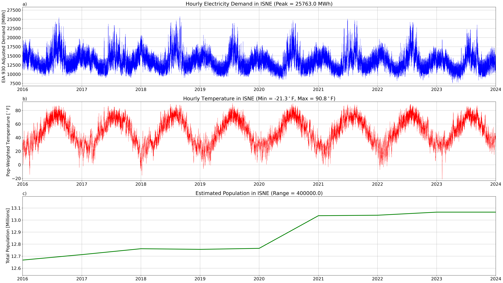
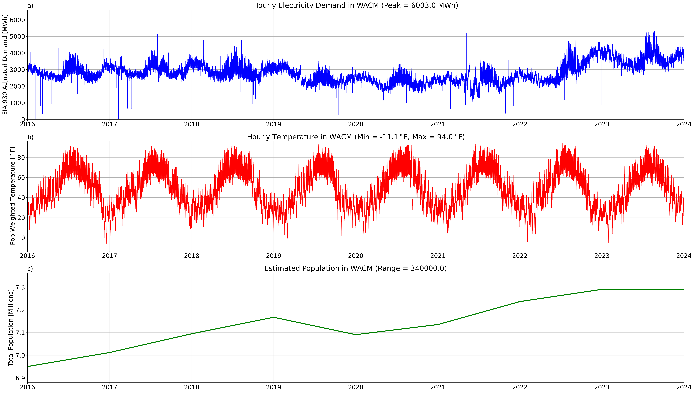

# Balancing Authority Level Analyses
>
| Name | Acronym |                             Time Series                             | TBD |
|:-:|:-------:|:-------------------------------------------------------------------:|:---:|
| Arizona Public Service Company |  AZPS   |  |     |
| Bonneville Power Administration |  BPAT   |  |     |
| California Independent System Operator |  CISO   |  |     |
| Electric Reliability Council of Texas |  ERCO   |  |     |
| Florida Power and Light |   FPL   |   |     |
| Independent System Operator of New England |  ISNE   |  |     |
| PJM Interconnection |   PJM   |   |     |
| Western Area Power Administration - Rocky Mountain Region |  WACM   |  |     |

