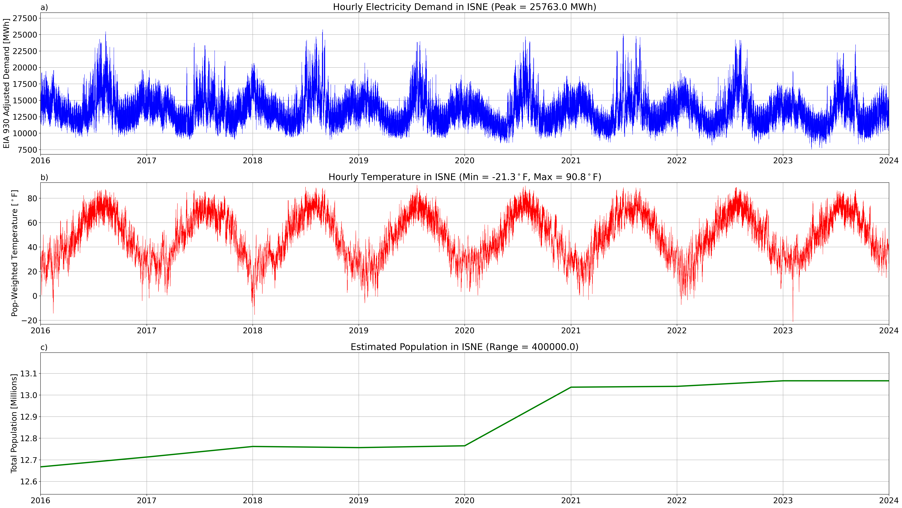

# Balancing Authority Level Analyses
>
|                    Name                    | Acronym |                             Time Series                             |                      Error Evolution                       |                     Diurnal: Dec-Jan-Feb                      |                     Diurnal: Mar-Apr-May                      |                     Diurnal: Jun-Jul-Aug                      |                     Diurnal: Sep-Oct-Nov                      |
|:------------------------------------------:|:-------:|:-------------------------------------------------------------------:|:----------------------------------------------------------:|---------------------------------------------------------------|:-------------------------------------------------------------:|:-------------------------------------------------------------:|:-------------------------------------------------------------:|
|       Arizona Public Service Company       |  AZPS   |  |  |  |  |  |  |
|      Bonneville Power Administration       |  BPAT   |  |  |  |  |  |  |
|   California Independent System Operator   |  CISO   |  |  |  |  |  |  |
|   Electric Reliability Council of Texas    |  ERCO   |  |  |  |  |  |  |
|          Florida Power and Light           |   FPL   |   |   |   |   |   |   |
| Independent System Operator of New England |  ISNE   |  |  |  |  |  |  |
|            PJM Interconnection             |   PJM   |   |   |   |   |   |   |
|            Southwest Power Pool            |  SWPP   |  |  |  |  |  |  |

